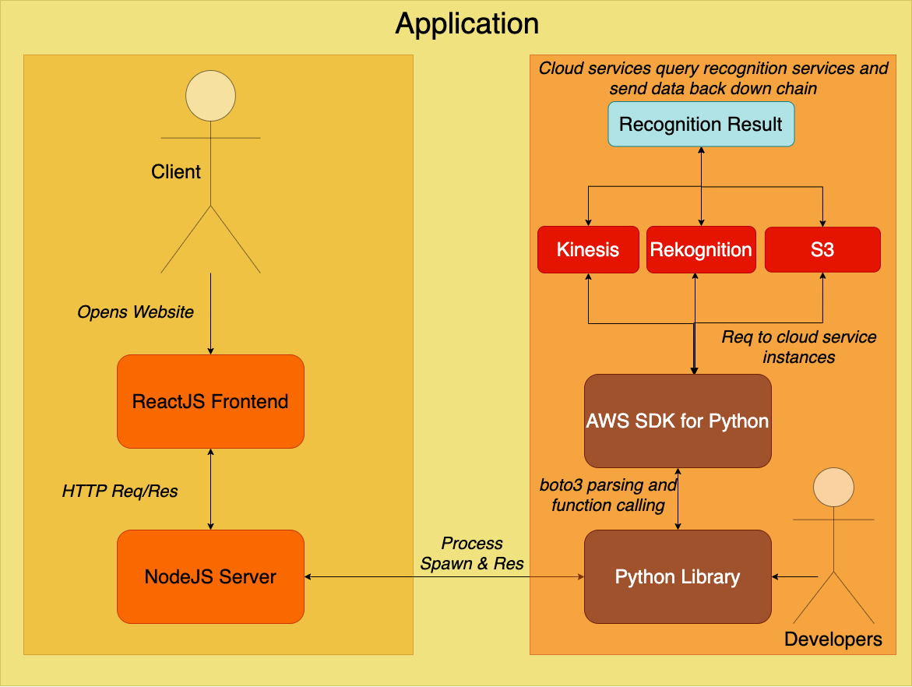

# eye-of-horus

A face and gesture recognition authentication system, the eye of horus is my Final Year University of Plymouth Project that will account for 40 credits of my grade this year. My supervisor for this project is [Professor Nathan Clark](https://www.plymouth.ac.uk/staff/nathan-clarke).

<p align="center">
    <a href="https://aws.amazon.com/s3/"></a>
    <a href="https://aws.amazon.com/rekognition/"></a>
    <a href="https://aws.amazon.com/kinesis/"></a>
    <a href="https://www.python.org/"></a>
    <a href="https://reactjs.org/"></a>
    <a href="https://nodejs.org/en/"></a>
</p>

## Table of Contents

- [Vision](#Vision)
- [Components](#Components)
    - [Website](#Website)
    - [Python](#Python)
- [Installation](#Installation)
    - [Architecture](#Architecture)
    - [Method](#Method)
- [Management](#Management)

## Vision

**For:** Users looking to protect their assets within safes or rooms and need a more reliable and secure solution than an easily stolen key or forgetful passphrase.

**Whose:** Problem of those who forget their forms of authentication or wish for only a single group of authorised people access to an asset.

**The**: Eye of Horus.

**Is A**: Facial and gesture recognition authentication system.

**That**: Combines two common biometric security features into one camera. It provides a secure, helpful authorisation system into a room, safe, house, you name it! Without the need to remember keys or passphrases, this camera uses facial recognition to recognise you as an authorised party to the asset as well as gesture recognition to accept a premade unlock pattern. To lock again, simply exit the asset and commit your locking gesture while looking up at the camera, exactly the same as what you’ve already done! Forgot either gesture? No problem! Simply recover your gesture with a good picture of yourself or another combination to reset your gesture there and then so you can make a new one!

## Components



This project consists of two major components. Those wishing to use the features of this project for development of their own project/products would be more interested in the [Python Library](#Python), where those who are just looking to play around and see how this could work in a production environment would be better suited looking into the [Website frontend](#Website) side of things.

### Website

This is a simple ReactJS frontend, NodeJS backend website used to showcase how to this application could work in a production environment. The website server utilises the python library to handle most of the work, just parsing and returning the responses, but could be a full blown recognition server too if setup appropriately.

Tests are directory based, meaning there is one [folder](src/tests) for running all backend and frontend tests against the website using Jest. To run the tests, execute `npm run jstest` from repository root.

### Python

This is a collection of python and shell scripts that handle, parse and execute queries and responses to and from the various AWS services listed above. After each action, a `response.json` file is produced that details what happened during the action. Check out the `README.md` at [src/scripts](src/scripts) for more information.

Tests are directory based, meaning there is one [folder](src/scripts) for running all backend and frontend tests against the website using pytest. To run the tests, execute `npm run pytest` from repository root (they will take some time due to the custom labels project having to boot up and shutdown after use).

## Installation

### Architecture

Everything on this project was built inside a Mac Catalina (and then Big Sur) operating system, the author cannot guarantee that this application will work on another system.

However, all of the software used does work on Windows and Linux and it should be possible to adapt your approach accordingly. Please contact the author if you need assistance on the matter.

Your device must also have a camera and should be using the latest version Google Chrome for the website (not needed for the python library).

### Method

*From the repository root in a terminal window...*

1. Install Node & Python
    - [Minimum Recommended Node version 12.18](https://nodejs.org/en/)
    - [Minimum Recommended Python Version 3.9](https://www.python.org/downloads/)
    - Ensure pip is installed with the Python binary
2. Install dependencies

```shell
npm install
cd src/server && npm install
cd src/scripts && pip install -r requirements.txt
```

3. [Install G-Streamer](https://docs.aws.amazon.com/rekognition/latest/dg/streaming-using-gstreamer-plugin.html) (only if you wish to use the streaming feature of this project)

4. Create Local Environment OR Import secrets
    - Ideally, you should create your own local environment. The author used a set of tutorials to setup the AWS services necessary for the completion of this project, [tracked by the first work item in this repo](https://github.com/M-Davies/eye-of-horus/issues/1). You are free to ask questions about the process as you see fit but the author cannot guarantee success or support on the matter. Once you are done, follow the instructions below about populating the `.env` file with your secrets.
    - Otherwise, to communicate with the author's AWS service, create a `.env` file at the repo root that is a copy of the [provided example file](example.env). Populate the template values with the ones the author has given you. Please request access to the values by [opening a new issue here](https://github.com/M-Davies/eye-of-horus/issues/new) along with a reason of why you need them and a secure contact method. Secrets provided in this manner can be revoked at anytime and the author reserves the right to do so without notice. These are personal keys and should not be shared at all. Finally, ensure boto3 can communicate with AWS by following [this guide](https://github.com/boto/boto3#using-boto3) (the authors region is `eu-west-1`).

5. Start the custom labels project (this can take up to 20mins)

```shell
python src/scripts/gesture/gesture_recog.py -a start
```

6. You're good to go! The python scripts are now ready to use. To use the website:
    - Start the backend nodejs server. From [src/server](src/server), execute `npm run start`
    - Open a separate terminal window. Execute `npm run start` and wait for the message `Compiled successfully!`. Finally, navigate to `http://localhost:3000/` in Chrome to view the frontend of the website.
    - Inside the website, you will be presented with the home page where you will need to enter a username for a new or existing account (the system will automatically detect which is which). Username's must be alphanumeric.

7. After you have finished development or investigation, please ensure to run `python src/scripts/gesture/gesture_recog.py -a stop` to stop the custom labels project. Failing to do so will result in additional financial charges as you are billed while it is in "active" state. For more information, see [Inference Hours](https://aws.amazon.com/rekognition/pricing/).

## Management

Due to university regulations on final year projects, my non code backlog is recorded on Microsoft Planner. Please click the link below to request access to the planner:
https://outlook.office365.com/owa/eyeofhorusPlanner@group.plymouth.ac.uk/groupsubscription.ashx?action=join&source=MSExchange/LokiServer&guid=a322b80f-c38a-44dd-b956-e9b43f82ec87

Code related tasks are recorded on the [GitHub Project Board](https://github.com/M-Davies/eye-of-horus/projects/1) to allow for greater automation and drawing of references between tasks. See active and past sprints (that are tied to the board and individual tasks) by [viewing the project milestones](https://github.com/M-Davies/eye-of-horus/milestones).
