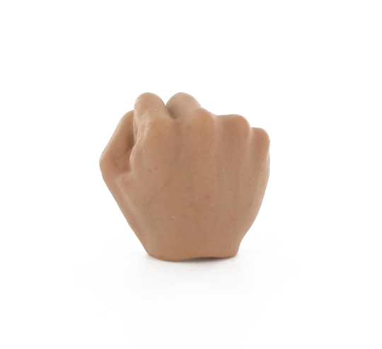
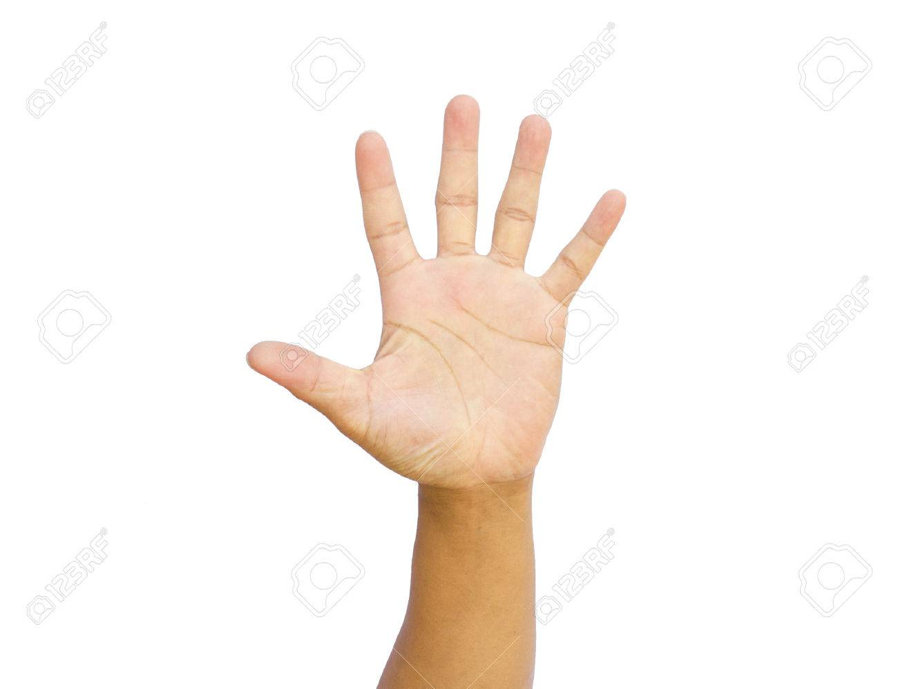
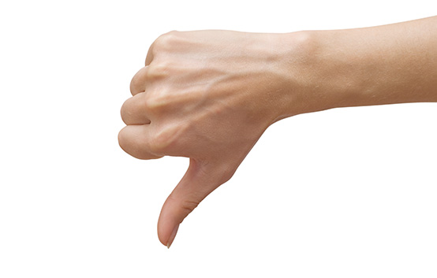
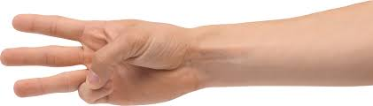

# Notes

This document contains info on my progress and vision for the machine learning model that will be able to tell a human gesture on stream.

## Gathering of training images

*See [#16](https://github.com/M-Davies/eye-of-horus/issues/16) for the work item of this*

AWS requires training images to be obtained and ran through the machine learning algorithm in order for it to identify a gesture a user is making on stream. To ensure as accurate machine learning algorithm as possible, we will be creating or retrieving a set of images containing the [proposed gestures](#AvailableGestures) to use for the training data set. The images need to be diverse, in large quantity, in a similar location to where the program will actually be used and clearly containing the training data we need for the algorithm to pick out the gestures from a sea of different objects. AWS defines a [series of standards](https://docs.aws.amazon.com/rekognition/latest/customlabels-dg/gs-step-prepare-images-cli.html) that we will try our best to stick to when creating the images.

NOTE: The following standards are all minimum requirements. It is likely that we will have more pictures than the target 50 (a good thing).

### Quantity

I intend to utilise 50 images for each [proposed gesture](#AvailableGestures).

Of these, **40 will be images I have taken and created myself, 10 being images I have pulled from the internet** to further train the model on unexpected or poor quality scenarios.

Of the 40 images, **20 will be created on my laptop camera and 20 on my phone camera** (to capture different resolutions).

### Quality

Of the 40 images I will create myself for each gesture, to ensure a diverse model, I will produce them in a set of different locations, angles and contexts:

- 10 images in low light
- 10 images in bright light
- 10 images in a neat background
- 10 images in a cluttered background

### Final Schema

*EXAMPLE FOR ONE GESTURE (so times this by 4 to get the total image count of 200):*

- **SELF IMAGES (40)**
  - *PHONE IMAGES (20)*
    - LOW LIGHT (5)
      - Neat Background (3)
      - Cluttered Background (2)
    - BRIGHT LIGHT (5)
      - Cluttered Background (3)
      - Neat Background (2)
  - *LAPTOP IMAGES (20)*
    - LOW LIGHT (5)
      - Neat Background (3)
      - Cluttered Background (2)
    - BRIGHT LIGHT (5)
      - Cluttered Background (3)
      - Neat Background (2)
- **INTERNET IMAGES (10)**
  - These are ambiguous and used to induce random data. As such, we will not split them up into sections based on the environment.

## Available Gestures

These gestures will be the initial "default" gestures user's can incorporate into their gesture unlock and lock patterns. More intend to be added over time but right now, this will be more than acceptable for my university demonstration and assignment.

- closed-hand (hand is closed with fingers together)

- open-hand (hand is open with fingers apart)

- thumb-out (hand is closed with thumb up or down, fingers together)

- three-fingers (hand is closed with the three central fingers pointing out)

## Optimal Results for eye-of-horus-gesture-project.2021-03-17T13.54.11

These are the recommended specifications to create your gesture images against. This will minimise false positives and negatives:

- Ensure that in your image, the gesture is taking up the majority of the foreground and that the background is not cluttered or containing any hands of any kind (even non-human ones!)
- For `closed-hand` images, you should use your RIGHT hand and the palm needs to be facing AWAY from camera
- For `open-hand` images, the palm needs to be facing TOWARDS camera
- For `thumb-out` images, you should use your RIGHT hand and the palm needs to be facing AWAY from camera (thumb down)
- For `three-fingers` images, the three fingers need to facing HORIZONTAL with the palm TOWARDS the camera
